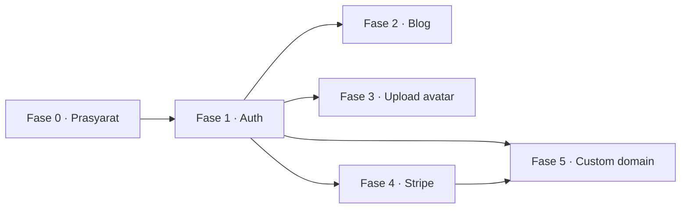

# TODO — Next Steps Multi-Tenant SaaS

Status per hari ini (yang sudah jalan, jangan dikerjakan ulang):

- ✅ Template JSON menyetir section portfolio (`theme.primaryColor`, `sections.*`) + seed `minimal`
- ✅ Routing subdomain (`client/proxy.ts`) → `/tenant/<slug>`, termasuk wildcard `*.localhost:3000`
- ✅ API Express 5 + Prisma 8 contract mode: `POST /api/tenants`, `GET /api/tenants/:slug`, `GET /api/templates`
- ✅ Migration baseline ter-commit + `develop.sh` (Postgres + API + client) & `deploy-production.sh`

Aturan main sepanjang repo ini:

1. **Setiap perubahan `api/prisma/schema.prisma`**: `npx prisma contract emit` → `npx prisma migration plan --name <slug>` → commit `api/migrations/` → `./develop.sh --db-only`. Tanpa paket migration, DB produksi baru tidak akan terbentuk.
2. **Referensi model Prisma 8**: `db.orm.public.<Model>.where({...}).first()` / `.create({...})` (tanpa wrapper `data`), teardown script pakai `db.close()`.
3. Jangan hardcode host/port di client — pakai `NEXT_PUBLIC_API_URL` (browser) & `API_URL` (SSR).

Urutan dependensi:



---

## Fase 0 — Prasyarat (wajib dulu, semua fitur di bawah bergantung ke sini)

### [ ] 0.1 Tambah relasi / foreign key

**Masalah:** DB sekarang **0 foreign key**. `Tenant.templateId` dan `Post.tenantSlug` cuma string — tenant bisa menunjuk template yang tidak ada, dan blog post bisa yatim.

- [ ] Di `schema.prisma`:

  ```prisma
  model Tenant {
    // ...
    template   Template @relation(fields: [templateId], references: [id])
    posts      Post[]
  }

  model Post {
    // ...
    tenant     Tenant @relation(fields: [tenantSlug], references: [slug])
  }
  ```

- [ ] `npx prisma contract emit` → `npx prisma migration plan --name add-relations` → `db migrate`
- [ ] Cek: `db verify` lolos + `\d "Post"` di psql menunjukkan FK

**Keputusan:** FK ke `Tenant.slug` berarti **slug harus immutable** (tidak boleh di-rename). Itu konsisten dengan subdomain routing, jadi aman — tapi kalau nanti mau slug bisa berubah, FK harus pindah ke `Tenant.id`.

**Acceptance:** `prisma db verify` OK, `select count(*) from pg_constraint where contype='f'` > 0.
Estimasi: **S**

### [ ] 0.2 Pagar minimum: typecheck + lint di satu perintah

- [ ] Script root `package.json` (baru) atau `Makefile`:

  ```json
  { "scripts": {
      "check": "npm --prefix api run typecheck && npm --prefix client run lint && npm --prefix client exec tsc -- --noEmit"
  } }
  ```

- [ ] Jalankan sebelum tiap commit; nanti dipakai CI (GitHub Actions) di Fase 6
- [ ] Tambah `.github/workflows/ci.yml`: install → `check` → `prisma db verify` terhadap Postgres service container

**Acceptance:** `npm run check` hijau di mesin bersih.
Estimasi: **S**

### [ ] 0.3 Hardening endpoint tenant yang sudah ada

**Masalah:** `POST /api/tenants` masih terbuka untuk siapa pun, tanpa rate limit, tanpa validasi schema, dan `cors()` menerima semua origin.

- [ ] Tambah `helmet` + `express-rate-limit` di `api/src/app.ts` (khusus `POST /api/tenants`)
- [ ] Validasi body pakai `zod` (ganti cast manual di `tenant.controller.ts`)
- [ ] CORS whitelist: `CLIENT_ORIGIN=http://localhost:3000` + `http://*.localhost:3000` (subdomain tenant ikut memanggil API)
- [ ] Setelah Fase 1: endpoint ini jadi butuh login, "create tenant" pindah ke onboarding

**Acceptance:** `curl` body invalid → 400 dengan detail field; origin asing → ditolak.
Estimasi: **S**

### [ ] 0.4 Tambah field yang dibutuhkan fase berikutnya (sekali migration)

- [ ] `Tenant.avatarUrl String?` (dipakai client sekarang, tapi belum ada di schema — selalu jatuh ke inisial)
- [ ] `Post.published Boolean @default(false)`, `Post.slug String`, `Post.updatedAt DateTime @updatedAt`
- [ ] `@@unique([tenantSlug, slug])` di `Post`
- [ ] `Tenant.ownerId String?` + `User` model (dipakai Fase 1)

**Acceptance:** `contract emit` + `migration plan --name tenant-post-fields` lolos, client `tsc` masih hijau.
Estimasi: **M**

---

## Fase 1 — Autentikasi (NextAuth v5) + dashboard tenant

**Target:** tenant bisa login, lalu edit portfolio-nya (bio, skills, pilih section) tanpa kehilangan data.

> ⚠️ **Temuan penting:** `@auth/prisma-adapter` **butuh `@prisma/client`**, sedangkan repo ini pakai Prisma 8 contract mode (`@prisma/orm-postgres`) tanpa `@prisma/client`. Jadi **jangan pakai Prisma adapter**. Pakai **JWT session** + simpan `User`/`Account` via `db.orm.public.*` sendiri (endpoint auth di API), atau tulis adapter custom.

### [ ] 1.1 Model auth di contract

- [ ] `User` (`id`, `email @unique`, `name`, `createdAt`), `Tenant.ownerId` FK ke `User.id`
- [ ] Kalau butuh OAuth: `Account` + `Session` mengikuti skema Auth.js — tapi dengan JWT strategy cukup `User` + `Account` (token OAuth)
- [ ] Migration + emit seperti biasa

### [ ] 1.2 NextAuth v5 di client

- [ ] `npm --prefix client i next-auth@beta` (peer `next: ^16` ✓ terverifikasi)
- [ ] `client/auth.ts` → `NextAuth({ session: { strategy: "jwt" }, providers: [...] })`
- [ ] `client/app/api/auth/[...nextauth]/route.ts` → export handler
- [ ] `AUTH_SECRET` di `client/.env.local` (jangan commit)
- [ ] Halaman `client/app/login/page.tsx` + tombol sign-in/sign-out

### [ ] 1.3 Jembatan session → API Express

Pilih satu (rekomendasi: A):

- [ ] **A. BFF di Next** — `next.config.ts` rewrites `/api/*` → `http://localhost:8080/api/*`; browser hanya bicara ke origin Next (cookie jalan, tanpa CORS). NextAuth mengeluarkan JWT, lalu route handler Next memanggil Express dengan header `Authorization: Bearer <token>`.
- [ ] **B. Cookie lintas origin** — `fetch(..., { credentials: "include" })` + CORS `credentials: true` + cookie `SameSite=None`. Lebih ribet di dev.

- [ ] Di Express: middleware verifikasi token (pakai `jose`, secret sama) → `req.tenantId`
- [ ] Endpoint baru: `PATCH /api/tenants/me` (update bio/skills/template config) — hanya untuk tenant milik session
- [ ] `POST /api/tenants` dipindah ke flow onboarding setelah login

### [ ] 1.4 Dashboard

- [ ] `client/app/dashboard/page.tsx` (di root domain, **bukan** subdomain — lihat catatan 5.1)
- [ ] Form edit bio/skills + toggle section (`hero`, `about`, `skills`, `projects`, `blog`, `contact`) → `PATCH /api/tenants/me`
- [ ] Preview link ke `http://<slug>.localhost:3000`
- [ ] `proxy.ts`: tambahkan **allowlist subdomain reserved** (`www`, `app`, `api`, `admin`) supaya `app.example.com` tidak ikut di-rewrite jadi `/tenant/app`

**Acceptance:** login → edit bio → refresh → data tetap; logout → dashboard menolak akses; tenant lain tidak bisa PATCH tenant ini (uji 403).
Estimasi: **L**

---

## Fase 2 — Manajemen blog (pakai model `Post`)

### [ ] 2.1 API blog

- [ ] `POST /api/posts` (create, `published: false` default), `PATCH /api/posts/:id`, `DELETE /api/posts/:id` — semua **scoped ke tenant dari session**
- [ ] `GET /api/posts?tenantSlug=...` (publik, hanya `published = true`)
- [ ] `GET /api/posts/:tenantSlug/:slug` (publik, satu post)
- [ ] Slug unik per tenant (`@@unique([tenantSlug, slug])` sudah di 0.4); generate dari title, tangani bentrok → 409

### [ ] 2.2 UI blog

- [ ] `client/app/dashboard/posts/page.tsx` — list + editor (textarea/markdown sederhana), tombol publish/unpublish
- [ ] `client/app/tenant/[slug]/blog/page.tsx` — daftar post published
- [ ] `client/app/tenant/[slug]/blog/[postSlug]/page.tsx` — detail + `generateMetadata` (title/description dari post)
- [ ] Section `blog` di portfolio sekarang menampilkan post asli (ganti array hardcode di `client/app/tenant/[slug]/page.tsx` baris ~276)
- [ ] Tombol "Projects" juga masih hardcode (baris ~253) — jadikan `Tenant.projects Json?` atau model `Project` terpisah

**Acceptance:** tenant A publish post → muncul di `a.localhost` dan **tidak** muncul di `b.localhost`.
Estimasi: **L**

---

## Fase 3 — Upload avatar (Cloudinary)

### [ ] 3.1 Cloudinary

- [ ] `npm --prefix api i cloudinary`; env `CLOUDINARY_URL` (atau `CLOUD_NAME`/`API_KEY`/`API_SECRET`)
- [ ] `POST /api/tenants/me/avatar` — terima `multipart/form-data` (`multer`), batasi ≤2 MB + tipe `image/*`, upload ke folder `tenants/<slug>`, simpan `secure_url` ke `Tenant.avatarUrl`
- [ ] Alternatif tanpa server: **unsigned upload preset** langsung dari browser (lebih sedikit kode, preset harus dibatasi folder + max size)

### [ ] 3.2 UI

- [ ] Di dashboard: input file + preview; setelah sukses panggil `PATCH`/refresh session
- [ ] Di `client/app/tenant/[slug]/page.tsx` fallback inisial **sudah siap** — begitu `avatarUrl` terisi, foto otomatis tampil
- [ ] Pakai `next/image` untuk optimisasi (butuh `images.remotePatterns` untuk domain Cloudinary di `next.config.ts`)

**Acceptance:** upload → avatar tampil di halaman tenant; file >2 MB / bukan gambar ditolak 400.
Estimasi: **M**

---

## Fase 4 — Stripe subscription

### [ ] 4.1 Model & env

- [ ] `Tenant`: `plan`, `stripeCustomerId`, `stripeSubscriptionId`, `subscriptionStatus`, `currentPeriodEnd`
- [ ] Env API: `STRIPE_SECRET_KEY`, `STRIPE_WEBHOOK_SECRET`, `STRIPE_PRICE_ID`
- [ ] **Stripe harus hidup di API Express** (bukan Next) karena API yang memegang DB

### [ ] 4.2 Checkout + portal

- [ ] `POST /api/billing/checkout` → buat Stripe Checkout Session, `success_url` ke dashboard
- [ ] `POST /api/billing/portal` → Billing Portal untuk ganti kartu/batal
- [ ] Tombol "Upgrade" di dashboard memanggil endpoint di atas

### [ ] 4.3 Webhook (raw body!)

- [ ] **Gotcha:** `express.json()` merusak signature Stripe. Daftarkan route webhook **sebelum** `express.json()`:

  ```ts
  app.post("/api/billing/webhook", express.raw({ type: "application/json" }), handler);
  app.use(express.json());
  ```

- [ ] Verifikasi `stripe.webhooks.constructEvent(body, sig, secret)` → update `subscriptionStatus`/`currentPeriodEnd`
- [ ] Idempotensi: simpan `event.id` yang sudah diproses
- [ ] Gate fitur: portfolio `unpublished` + banner kalau langganan lewat `currentPeriodEnd`

**Acceptance:** `stripe listen --forward-to localhost:8080/api/billing/webhook` → status tenant berubah; event duplikat tidak memproses dua kali.
Estimasi: **L**

---

## Fase 5 — Custom domain (paling akhir, paling berat)

### [ ] 5.1 Keputusan arsitektur

- [ ] **Proxy Next 16 default-nya runtime Node.js** (terverifikasi di `node_modules/next/dist/docs/.../proxy.md`), jadi lookup DB dari `proxy.ts` *bisa* — tapi satu query per request itu mahal. Lebih baik: proxy hanya meneruskan `Host` lewat header, dan **page (server component)** yang resolve domain → slug.
- [ ] Tabel `Domain` (`host @unique`, `tenantSlug`, `verifiedAt`, `verificationToken`)
- [ ] `proxy.ts` sekarang me-rewrite **setiap** subdomain ke `/tenant/<slug>`; untuk custom domain (`janedoe.com`) perlu jalur baru: kalau host bukan domain kita dan bukan IP, jangan rewrite — biar page yang menentukan

### [ ] 5.2 Alur verifikasi

- [ ] Dashboard: input domain → generate token → user pasang `CNAME janedoe.com → cname.example.com` (atau TXT untuk verifikasi)
- [ ] Job verifikasi (cron/saat dibuka): DNS lookup + tandai `verifiedAt`
- [ ] Halaman tenant resolve: host → `Domain` → `tenantSlug`; kalau belum terverifikasi → 404

### [ ] 5.3 Infrastruktur (di luar kode)

- [ ] Wildcard TLS (`*.example.com`) + sertifikat per custom domain (Let's Encrypt/ACME atau Cloudflare for SaaS)
- [ ] Reverse proxy (Nginx/Caddy/Traefik) yang meneruskan semua Host ke Next
- [ ] **Cookie auth ikut terdampak:** session NextAuth harus `domain: .example.com` untuk dipakai lintas subdomain; custom domain di luar `example.com` praktis **tidak** ikut kebagian cookie → dashboard tetap di domain utama

**Acceptance:** domain terverifikasi membuka portfolio tenant yang benar; domain belum terverifikasi → 404; cert valid.
Estimasi: **XL**

---

## Fase 6 — Ops (paralel, jangan ditunda)

- [ ] Dockerfile API + service `api` di `docker-compose.yml` (dev), lalu image produksi multi-stage
- [ ] CI: `check` + `prisma db verify` + build client
- [ ] Backup terjadwal (`deploy-production.sh --backup` baru manual; jadikan cron/pgBackRest)
- [ ] Observability: request log terstruktur + `/ready` (sudah ada) dipakai healthcheck orchestrator
- [ ] Test: minimal integration test endpoint tenant (`supertest`) + 1 snapshot render halaman tenant

---

## Urutan eksekusi yang disarankan

| # | Fase | Kenapa di sini | Estimasi |
|---|------|----------------|----------|
| 1 | 0.1 relasi/FK | semua fitur menyentuh DB, FK dulu supaya migration berikutnya bersih | S |
| 2 | 0.4 field baru | digabung sekali migration dengan 0.1 kalau mau hemat | M |
| 3 | 0.2 + 0.3 pagar | mencegah regresi sebelum fitur menumpuk | S |
| 4 | 1 Auth + dashboard | pintu masuk semua fitur tenant-facing | L |
| 5 | 2 Blog | memanfaatkan `Post` yang sudah ada, tanpa layanan eksternal | L |
| 6 | 3 Avatar | kecil, tapi butuh 0.4 (`avatarUrl`) | M |
| 7 | 4 Stripe | butuh auth + status langganan | L |
| 8 | 5 Custom domain | butuh DNS/TLS di hosting, cookie tetap di domain utama | XL |
| 9 | 6 Ops | jalan paralel sejak sekarang | — |
